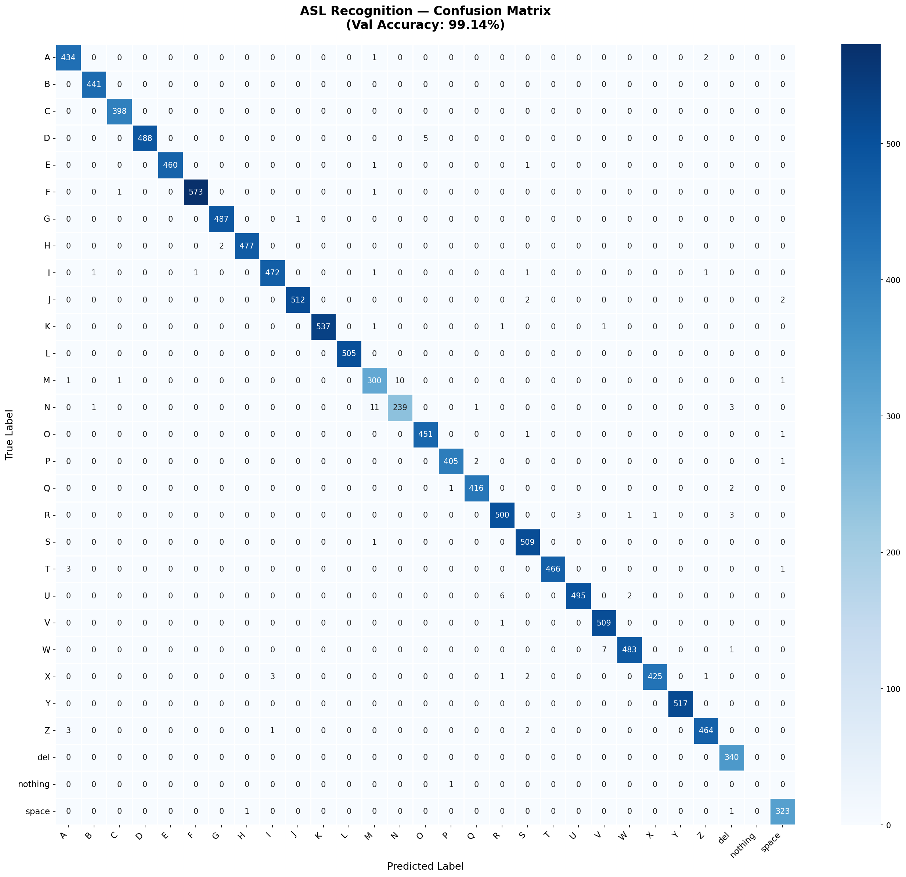

# 🤟 ASL Recognition System

A real-time American Sign Language (ASL) alphabet recognition system built with deep learning, achieving **99.14% validation accuracy** across 29 classes.

🚀 **Live Demo:** [asl-recognition26.streamlit.app](https://asl-recognition26.streamlit.app)

---

## 📸 Demo


---

## 🎯 Project Overview

This system recognizes all 26 ASL alphabet letters plus `del`, `space`, and `nothing` gestures in real time using a webcam or uploaded images.

**Key Features:**
- 99.14% validation accuracy
- Real-time inference using MediaPipe hand landmarks
- Confidence thresholding (85%) to avoid wrong predictions
- Word builder — spell words letter by letter
- Deployed as a live web app

---

## 📊 Results

### Training Comparison

| Run | Dataset | Accuracy |
|-----|---------|----------|
| Run 1 | 500 images/class (14.5K total) | 89.79% |
| Run 2 | 3000 images/class, unfiltered (87K) | 75.94% |
| Run 3 ✅ | 3000 images/class, filtered (~60K) | **99.14%** |

> **Key insight:** Filtering failed MediaPipe detections (zero vectors) improved accuracy by **23%**

### Confusion Matrix



**Analysis:**
- **M vs N** — most confused pair (differ by only 1 finger under thumb in ASL)
- **B, C, L, Y** — perfect or near-perfect classification
- Most letters achieved **>99% per-class accuracy**

---

## 🏗️ System Architecture

Webcam / Image
↓
MediaPipe Hand Detection
↓
21 Landmarks (x, y, z) extracted
↓
Normalization → 63-dim vector
(wrist-relative, scale-invariant)
↓
MLP Neural Network
Input(63) → Dense(512) → Dense(256) → Dense(128) → Dense(64) → Output(29)
↓
Confidence Check (≥85%)
↓
Predicted ASL Letter
---

## 📁 Project Structure
ASL-Recognition/
├── app.py                  ← Streamlit web app
├── extract_and_train.py    ← Feature extraction + model training
├── inference.py            ← Real-time webcam inference
├── confusion_matrix.py     ← Evaluation & visualization
├── train.py                ← Dual-input model training
├── src/
│   ├── hand_tracking.py    ← MediaPipe hand detection
│   ├── preprocessing.py    ← Landmark normalization & augmentation
│   ├── model.py            ← Dual-input CNN+MLP architecture
│   └── dataset.py          ← Data generator
├── models/
│   ├── asl_landmark_model.h5
│   └── label_map.json
├── confusion_matrix.png
├── requirements.txt
└── packages.txt

---

## ⚙️ How It Works

### Phase 1 — Dataset
- **ASL Alphabet Dataset** from Kaggle
- 87,000 images across 29 classes (A–Z + del, space, nothing)
- 3,000 images per class

### Phase 2 — Hand Detection
- **MediaPipe Hands** extracts 21 landmarks per hand
- Each landmark has `(x, y, z)` coordinates
- Bounding box + ROI crop for image branch

### Phase 3 — Preprocessing
- **Landmark normalization:**
  - Subtract wrist → position invariant
  - Divide by max distance → scale invariant
  - Flatten to 63-dim vector
- **Augmentation:** HorizontalFlip, Rotate±15°, BrightnessContrast, Affine zoom

### Phase 4 — Model Training
- **Architecture:** MLP on 63-dim landmark vectors
- **Layers:** Dense(512) → BN → Drop(0.4) → Dense(256) → BN → Drop(0.4) → Dense(128) → BN → Drop(0.3) → Dense(64) → Dense(29)
- **Optimizer:** Adam (lr=1e-3)
- **Loss:** Sparse Categorical Crossentropy
- **Callbacks:** EarlyStopping (patience=5), ReduceLROnPlateau

### Phase 5 — Real-Time Inference
- OpenCV webcam loop at ~30 FPS
- Smoothing buffer (majority vote over last 5 frames)
- Confidence threshold of 85% for display

---

## 🛠️ Tech Stack

| Tool | Version | Purpose |
|------|---------|---------|
| Python | 3.10 | Core language |
| TensorFlow | 2.x | Model training & inference |
| MediaPipe | 0.10.x | Hand landmark detection |
| OpenCV | 4.x | Image processing & webcam |
| Streamlit | Latest | Web UI & deployment |
| scikit-learn | Latest | Data splitting & metrics |
| Albumentations | 1.3.1 | Data augmentation |

---

## 🚀 Run Locally

**1. Clone the repo:**
```bash
git clone https://github.com/AsmiSingh26/ASL-Recognition.git
cd ASL-Recognition
```

**2. Create virtual environment:**
```bash
py -3.10 -m venv asl-env
.\asl-env\Scripts\activate  # Windows
```

**3. Install dependencies:**
```bash
pip install -r requirements.txt
```

**4. Run the web app:**
```bash
streamlit run app.py
```

**5. Run real-time webcam inference:**
```bash
python inference.py
```

---

## 📈 Model Performance

- **Validation Accuracy:** 99.14%
- **Training Samples:** ~60,000 (filtered from 87,000)
- **Classes:** 29 (A–Z + del, space, nothing)
- **Inference Speed:** Real-time (~30 FPS on CPU)
- **Model Size:** 238 KB

---

## 🔍 Key Findings

1. **Data quality > Data quantity** — filtering 27K bad MediaPipe detections improved accuracy by 23%
2. **M and N** are the hardest letters — they differ by only one finger position in ASL
3. **Landmark-based MLP** outperforms raw image CNN for this task because hand shape is more important than appearance
4. **Smoothing buffer** (5 frames majority vote) eliminates flickering in real-time inference

---

## 👩‍💻 Author

**Asmi Singh**
- GitHub: [@AsmiSingh26](https://github.com/AsmiSingh26)
- Live App: [asl-recognition26.streamlit.app](https://asl-recognition26.streamlit.app)

---

## 📄 License

MIT License — free to use and modify.

---

## 🙏 Acknowledgements

- [ASL Alphabet Dataset](https://www.kaggle.com/datasets/grassknoted/asl-alphabet) by grassknoted on Kaggle
- [MediaPipe](https://mediapipe.dev/) by Google
- [Streamlit](https://streamlit.io/) for deployment
